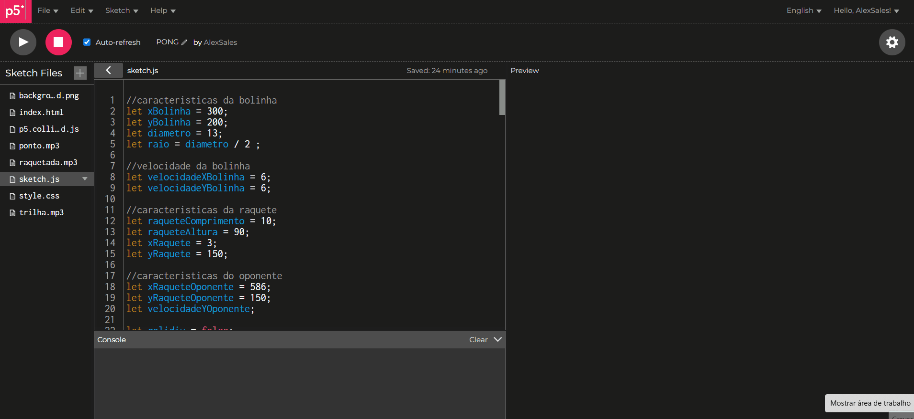

<h1 align='center'>📚Jogo Pong<h1>
<h3 align='center'>Projeto de curso: Recriação do classico jogo Pong.</h3>

<h3>📄Tabela de conteúdos</h3>
=================
<!--ts--><br>
   * <a href="#status">Status</a><br>
   * <a href="#features">Features</a><br>
   * <a href="#previa">Prévia</a><br>
   * <a href="#pre-requisitos">Pré-requisitos</a><br>
   * <a href="#instruçoes">Instruções</a><br>
   * <a href="#tecnologias">Tecnologias</a><br>
   * <a href="#autor">Autor</a><br>
<!--te-->

<h3 id="status" align='center'>✅ STATUS: Projeto concluído✅</h4>

<h3 id=features>⚙ Features<h3>
- [x] Criação do background<br>
- [x] Criação dos atores<br>
- [x] Logica de colisões<br>
- [x] Multiplayer local<br>
- [x] Fim de jogo<br>

  
 <h1 id="previa" align="center">
  
<h1/>
  <hr>
  
<h2 id="pre-requisitos">🖥️Pré-requisitos</h2>
  <p>Antes de começar, você precisará fazer os seguintes passos: Acesse o editor <a href='https://editor.p5js.org/'>p5js<a>, faça dowload e adicione todos os arquivos de audio, imagens que você deseja usar e o arquivo do codigo de colisão .</p>
    
 <h3 id="instruçoes" >📖 Instruções:</h3>
    
 ```bash
 # Desenvolvento o codigo:
 $ crie os arquivos e cole os respectivos codigos
 # Execute o codigo :
 $ Usando o botão de play para começar, basta clicar na area do jogo para ter acesso a movimentar as raquetes
 ```
    
 <h3 id="tecnologias">🛠 Tecnologias </h3>
 As seguintes ferramentas foram utilizadas na construção do projeto:<br>
   - HTML<br>
   - CSS<br>
 - JavaScript
    <hr>
    
  <p id="autor">De ALEX SALES🤘 <a href='https://www.linkedin.com/in/alexsales-dev/'>Veja meu linkedin<a></p>

